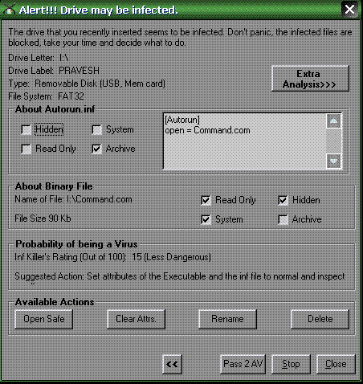



## DNA \(DNA is Not an Antivirus\) an USB/ Removable Media Monitor/Protector

### Description

Viruses have made the computers alarmingly defenseless. With advent of each virus, the whole computer world goes into

a state of chaos. Viruses can master the whole system and steal your credit cards of other sensitive information.

Moreover, they can crash your whole system and your company's sensitive information will be gone.

Once a virus makes way into a system then it can bring the system into its knees. But every virus has a weak point.

That is, it must first be copied into the victim's computer.

We all know that the virus needs some medium to get copied. Nowadays Internet and the pen drives are the

most frequently used mediums. DNA (DNA is Not an Antivirus.) monitors your removable devices and prevents the transmission

of the virus into your system. Since, prevention is always better than cure, thus, DNA proves, sometimes, itself even better

than an Antivirus. It's a complete open source package. Thus, you also get the source code of DNA and yourself master

the tactics to prevent infection. DNA has some advanced features too like immunization, detection of executable folders

and probability meter. When you get used to it, you surely will find it an important tool.

You can learn following things from DNA

*Subclassing

*Detecting arrival and removal of Removable Drives.

*Creating non-deletable Folders.

*Finding all Folders from a specified path etcs.
 
### More Info
 

             |
---                |---
**Submitted On**   |2009-12-04 18:30:30
**By**             |[Pravesh Koirala](https://github.com/Planet-Source-Code/PSCIndex/blob/master/ByAuthor/pravesh-koirala.md)
**Level**          |Advanced
**User Rating**    |5.0 (10 globes from 2 users)
**Compatibility**  |VB 6\.0
**Category**       |[Complete Applications](https://github.com/Planet-Source-Code/PSCIndex/blob/master/ByCategory/complete-applications__1-27.md)
**World**          |[Visual Basic](https://github.com/Planet-Source-Code/PSCIndex/blob/master/ByWorld/visual-basic.md)
**Archive File**   |[DNA\_\(DNA\_i2172871152010\.zip](https://github.com/Planet-Source-Code/pravesh-koirala-dna-dna-is-not-an-antivirus-an-usb-removable-media-monitor-protector__1-72840/archive/master.zip)

